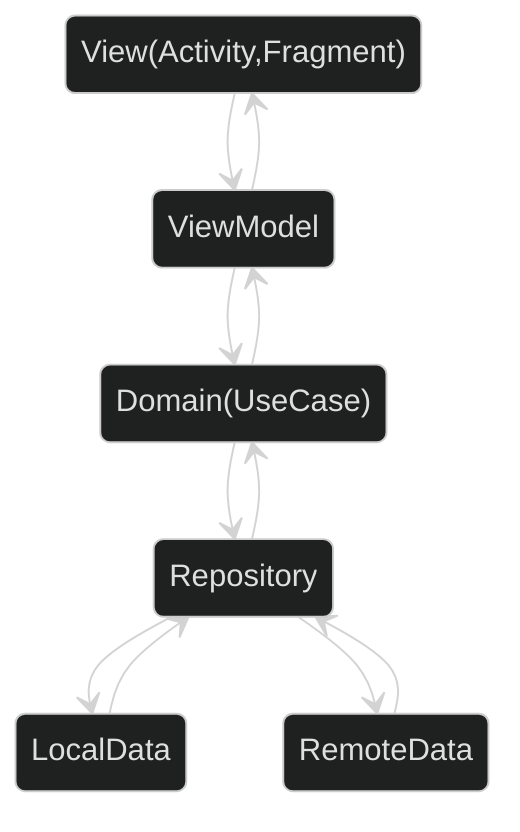

# SpaceXTracker Android App

SpaceXTracker is an Android application that provides real-time information about SpaceX rockets. The app is
developed with Kotlin and utilizes SpaceX APIs to fetch the data.

## Demo

https://github.com/basarYargici/SpaceXTracker/assets/60785366/7b245271-19fd-4361-b594-bfd2da8e6527

## Features

- View upcoming SpaceX launches with details such as rocket information and origin.
- Add rockets to favorites for quick access to them.
- Remove rockets from favorites when no longer needed.
- Swipe to Refresh: Update content effortlessly with a simple swipe gesture. Pull down the list of upcoming
  launches or favorite rockets to fetch the latest data from SpaceX APIs, providing up-to-date information
  without leaving the current screen.
- Smooth and efficient user experience thanks to the integration of Kotlin Coroutines and Flows.
- Easily navigate through different app screens using the Navigation Component.
- Manage dependency injection with Hilt, making the codebase clean and maintainable.
- Utilize Coil for efficient and seamless image loading.
- SpaceXTracker is developed following a Single Activity Multiple Fragment approach. This architecture
  promotes modularity and efficient resource management.
- Unit Tests using MockK, Truth, and FlowTurbine: SpaceXTracker's codebase is thoroughly tested with the MockK
  library for mocking, Truth for assertion, and FlowTurbine for testing Kotlin Flows. These tests ensure the
  app's reliability and stability, providing a robust user experience.

## Architecture

SpaceXTracker follows the MVVM pattern combined with Clean Architecture principles, separating concerns and
making the app more maintainable and testable.

### MVVM (Model-View-ViewModel)

MVVM is the architectural pattern used to structure the app's user interface and business logic. It separates
the app into three main components:

1. Model: Represents the data and business logic of the application. It handles data retrieval from the SpaceX
   APIs and data storage with Room Database.
2. View: Represents the user interface. It observes changes from the ViewModel and updates the UI accordingly.
3. ViewModel: Acts as a mediator between the Model and the View. It holds and processes data, as well as
   handles user interactions. It also exposes data to the View via LiveData or Kotlin Flows.

### Clean Architecture

Clean Architecture emphasizes the separation of concerns by dividing the app into layers, each with its
specific responsibilities:

1. Presentation Layer: This layer contains the MVVM components (View and ViewModel) and is responsible for
   rendering the user interface and handling user interactions.

2. Domain Layer: Contains the business logic and use cases. It is independent of the Presentation Layer and
   communicates through interfaces or contracts.

3. Data Layer: Handles data retrieval and storage. It communicates with the Domain Layer through interfaces,
   abstracting the data sources.

## Dependencies

SpaceXTracker Android app uses the following libraries and frameworks to provide its functionality:

- **Kotlin:** The primary programming language used for developing the app, known for its concise and
  expressive syntax.

- **Room Database:** A robust and efficient SQLite object mapping library for Android. It is used for storing
  favorite rockets locally in the app, providing offline access to the user's favorite content.

- **Kotlin Coroutines:** A powerful and flexible concurrency framework for Kotlin. It is utilized to handle
  asynchronous tasks, such as network requests and database operations, in a clean and concise manner.

- **Navigation Component:** A part of Android Jetpack, the Navigation Component simplifies navigation in the
  app, allowing users to move between different screens with ease.

- **Hilt:** An official dependency injection library for Android, developed by Google. Hilt simplifies
  dependency injection and aids in building scalable and maintainable apps.

- **Coil:** A fast, lightweight, and modern image loading library for Android. Coil is used to load and cache
  images from the web, ensuring smooth and efficient image loading in the app.

- **MVVM with Clean Architecture:** The app follows the MVVM (Model-View-ViewModel) architectural pattern
  combined with Clean Architecture principles. This separation of concerns makes the app more maintainable,
  testable, and scalable.

By utilizing these powerful and reliable libraries and architecture, SpaceXTracker delivers a seamless user
experience and robust performance for SpaceX enthusiasts to explore upcoming launches and rockets.

## How to Build the App

To build the SpaceXTracker Android app, follow these steps:

1. Clone the repository to your local machine.
2. Open the project in Android Studio.
3. Build the project using the gradle build command.
4. Install the app on your Android device or emulator.

## Credits

SpaceXTracker relies on SpaceX APIs for fetching real-time data about launches and rockets. Special thanks to
SpaceX for providing the APIs that make this app possible.